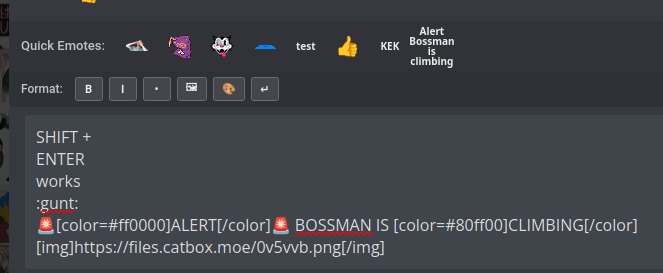
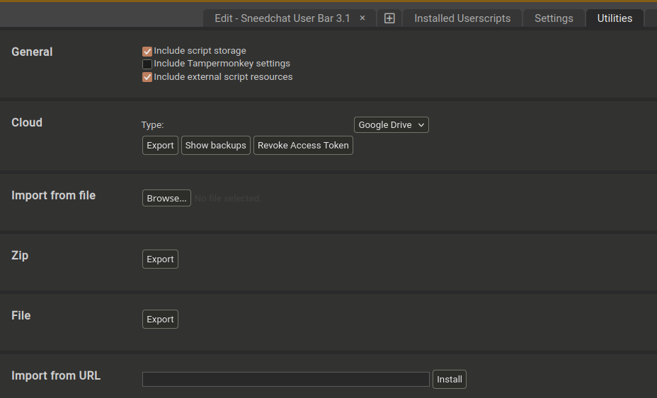

# Sneedchat Enhancer

A Tampermonkey userscript that adds enhanced features to Sneedchat, including quick emote insertion, text formatting tools, and improved chat input functionality.

## Features

- **Quick Emote Bar**: Easy access to frequently used emotes with single-click insertion
- **Format Toolbar**: BBCode formatting buttons for text styling (bold, italic, underline, etc.)
- **Color Picker**: Visual color selection tool for colored text
- **Smart Input Resizing**: Auto-expanding chat input that adjusts to content
- **Shift+Enter Support**: Send messages with Enter, add newlines with Shift+Enter
- **Shift+Click Emotes**: Hold Shift while clicking emotes to insert without auto-sending





## Installation

### Prerequisites

1. Install the [Tampermonkey](https://www.tampermonkey.net/) browser extension:
   - [Chrome/Edge/Brave](https://chrome.google.com/webstore/detail/tampermonkey/dhdgffkkebhmkfjojejmpbldmpobfkfo)
   - [Firefox](https://addons.mozilla.org/en-US/firefox/addon/tampermonkey/)
   - [Safari](https://apps.apple.com/us/app/tampermonkey/id1482490089)

### Script Installation

1. Open Tampermonkey dashboard by clicking the Tampermonkey icon in your browser toolbar
2. Click the "+" tab to create a new script
3. Delete any default content
4. Copy the entire contents of `user-bar.js` and paste it into the editor
5. Click **File → Save** or press `Ctrl+S` (or `Cmd+S` on Mac)
6. The script will automatically run on Sneedchat pages


You can alternatively add it via this link: https://raw.githubusercontent.com/ClaudetteTheGreat/sneed-bar/refs/heads/master/user-bar.js which supports updates in Tampermonkey



Check for updates in the script settings.


## Usage

### Emote Bar
- Click any emote to insert it into the chat input
- If the input only contains the emote code, it will auto-send
- Hold **Shift** while clicking to insert without auto-sending

### Format Toolbar
- **B**: Bold text `[b]text[/b]`
- **I**: Italic text `[i]text[/i]`
- **U**: Underline text `[u]text[/u]`
- **Color Palette**: Opens color picker for colored text
- **↵**: Insert line break `[br]`

Select text first to wrap it with formatting, or click to insert empty tags.

### Keyboard Shortcuts
- **Enter**: Send message
- **Shift+Enter**: Add new line without sending
- **Escape**: Close color picker or cancel edit

## Configuration

The script includes customizable settings at the top of the file:

```javascript
 const emotes = [
        {
            code: ':lossmanjack:',
            url: 'https://kiwifarms.st/styles/custom/emotes/bmj_loss.png',
            title: 'Loss Man Jack'
        },
        {
            code: ':juice:',
            url: 'https://kiwifarms.st/styles/custom/emotes/bmj_juicy.gif',
            title: 'Juice!'
        },
        {
            code: ':ross:',
            url: 'https://kiwifarms.st/styles/custom/emotes/bmj_ross_hq.png',
            title: 'Ross',
        },
        {
            code: ':gunt:',
            url: 'https://kiwifarms.st/styles/custom/emotes/gunt.gif',
            title: 'Gunt',
        },        
        // Example using a text entry in the bar instead of a thumbnail        
        {
            code: '[img]https://files.catbox.moe/0v5vvb.png[/img]',
            text: 'Drooling Avelloon',
            title: 'Drooling Avelloon'
        },
        // Example emoji/text entries (you can add more)
        {
            code: '🤡',
            emoji: '🤡',
            title: 'What are you laughing at?'
        },
        {
            code: '5',
            text: '5',
            title: 'Type a 5 in the chat if you think hes weird.'
        },
        {
            code: '🚨[color=#ff0000]ALERT[/color]🚨 BOSSMAN IS [color=#80ff00]CLIMBING[/color]',
            text: 'Alert Bossman is climbing',
            title: 'Climbing'
        }
    ];
```

## Updating

To update the script:
1. Open Tampermonkey dashboard
2. Click on "Sneedchat Enhancer"
3. Replace the code with the latest version from `user-bar.js`
4. Save the changes


## Browser Compatibility

- Chrome/Chromium-based browsers: Not tested. supported
- Firefox: Fully supported
- Safari: Not tested but supported with Tampermonkey
- Firefox Mobile:  Limited support (requires mobile Tampermonkey)

## License

This 